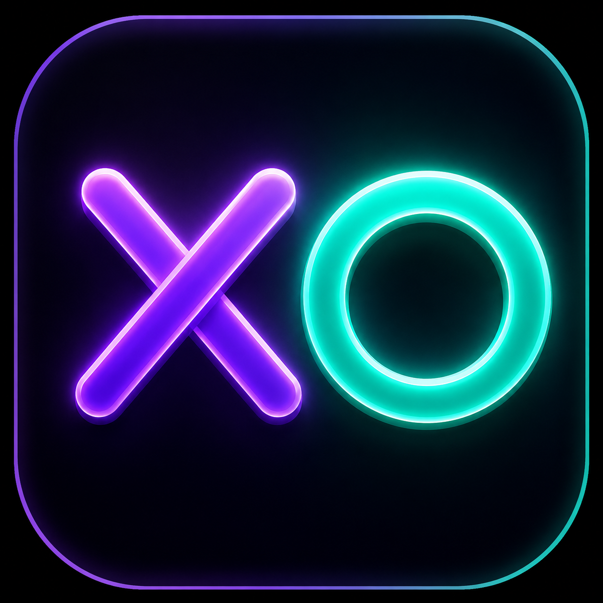

<div align="center">



# ✦ TIC TAC TOE

### A sleek, neon-dark two-player browser game built with vanilla HTML, CSS & JavaScript

[](https://developer.mozilla.org/en-US/docs/Web/HTML)
[](https://developer.mozilla.org/en-US/docs/Web/CSS)
[](https://developer.mozilla.org/en-US/docs/Web/JavaScript)
[](#)
[](LICENSE)
[](https://YOUR_PROJECT.vercel.app)

<br/>

> 🔗 **Live Demo → [YOUR_PROJECT.vercel.app](https://YOUR_PROJECT.vercel.app)**

> **Zero dependencies. Zero frameworks. Pure web magic.**
> A polished Tic Tac Toe experience with smooth animations, a persistent scoreboard, and full mobile responsiveness — all in under 300 lines of vanilla code.

<br/>

---

</div>

## 📸 Preview

<div align="center">

| Player Setup | Win State | Game Board |
|:---:|:---:|:---:|
|  |  |  |
| *Enter custom player names* | *Winner announcement with glow* | *Live game with X & O placed* |

</div>

---

## ✨ Features

| Feature | Description |
|---|---|
| 🎮 **Two-Player Mode** | Local multiplayer with custom player names |
| 🧠 **Smart Turn Logic** | Alternates who starts first each new round |
| 🏆 **Live Scoreboard** | Tracks X wins, O wins, and draws across rounds |
| 💥 **Win Detection** | All 8 winning combinations detected instantly |
| 🌟 **Winning Highlight** | Winning cells glow with a purple pulse animation |
| 🤝 **Draw Detection** | Detects and announces draws with a board shake |
| ✍️ **Custom Player Names** | Submit screen to name your players before playing |
| 📱 **Fully Responsive** | Optimized for desktop, tablet, and mobile (down to 360px) |
| ⚡ **Zero Dependencies** | Pure vanilla HTML, CSS, JavaScript — no libraries |
| 🎨 **Neon Dark Theme** | Deep space aesthetic with gradient accents |

---

## 🎨 Design Highlights

### 🌈 Color Palette

```
Background    #0F0E17   Deep space black
Surface       #1A1826   Elevated panels
Border        #2A2840   Subtle outlines
X Color       #9490E8   Violet / Purple
O Color       #3ECFA0   Teal / Mint
Text Primary  #C5C3E0   Soft lavender white
Text Muted    #4A4768   Dimmed purple-grey
Win Accent    #FAC775   Gold / Amber
```

### 🎞️ Animations

| Animation | Trigger | Effect |
|---|---|---|
| `pop-in` | Symbol placed | Scale 0→1 with spring bounce |
| `win-glow` | Winning cells | Infinite purple box-shadow pulse |
| `shake` | Draw result | Board shakes left–right |
| `turn-pulse` | Active turn text | Opacity breathes 100%→55% |

---

## 🗂️ Project Structure

```
tic-tac-toe/
│
├── 📄 index.html           # Game markup & structure
├── 🎨 index.css            # Dark theme, animations, responsive CSS
├── ⚙️ index.js             # Game logic, event handlers, state management
├── 🖼️ icon.png             # App icon (neon XO logo)
└── 📁 screenshots/
    ├── screenshot1.png     # Player setup screen
    ├── screenshot2.png     # Win state
    └── screenshot3.png     # Live game board
```

---

## 🚀 Getting Started

### Option 1 — Open Directly

No server needed. Just clone and open.

```bash
git clone https://github.com/jotishnitr/tic-tac-toe.git
cd tic-tac-toe
open index.html        # macOS
# or
start index.html       # Windows
# or
xdg-open index.html    # Linux
```

### Option 2 — Live Server (Recommended for Dev)

```bash
# Using VS Code Live Server extension
# Right-click index.html → "Open with Live Server"

# Or using Python
python -m http.server 8080
# Visit: http://localhost:8080
```

### Option 3 — Deploy to Vercel (Recommended)

```bash
# Install Vercel CLI
npm install -g vercel

# Deploy from project folder
vercel

# Follow the prompts → get a live URL instantly!
```

Or deploy with one click:

[](https://vercel.com/new/clone?repository-url=https://github.com/jotishnitr/tic-tac-toe)

---

## 🕹️ How to Play

```
1. Enter Player 1 and Player 2 names → click Submit
2. Player X always goes first in Round 1
3. Click any empty cell to place your symbol
4. First to get 3 in a row (horizontal, vertical, or diagonal) wins!
5. The active player indicator pulses at the top
6. Winning cells glow purple — draw shakes the board
7. Click "New Game" to play again (turn order alternates each round)
8. Score persists across rounds until you submit new names
```

---

## 🧩 Game Logic Overview

```javascript
// 8 possible winning combinations (index-based)
const winningCombinations = [
  [0,1,2], [3,4,5], [6,7,8],   // rows
  [0,3,6], [1,4,7], [2,5,8],   // columns
  [0,4,8], [2,4,6]              // diagonals
];

// After each move:
// 1. Check all 8 combinations for X or O sweep
// 2. If no winner, check if all 9 cells are filled (draw)
// 3. Update scoreboard and highlight result
```

**State variables managed:**
- `isXTurn` — whose turn it currently is
- `xStarts` — toggles who starts next round
- `gameOver` — prevents moves after result
- `XPoints`, `OPoints`, `drawPoints` — running scores

---

## 📱 Responsive Breakpoints

| Breakpoint | Target | Box Size |
|---|---|---|
| `> 768px` | Desktop | 96 × 96 px |
| `≤ 768px` | Tablets & large phones | 88 × 88 px |
| `≤ 480px` | Small phones | 74 × 74 px |
| `≤ 360px` | Very small phones | 64 × 64 px |

---

## 🧪 Browser Compatibility

| Browser | Supported |
|---|---|
| Chrome 90+ | ✅ |
| Firefox 88+ | ✅ |
| Safari 14+ | ✅ |
| Edge 90+ | ✅ |
| Mobile Chrome / Safari | ✅ |

> Uses only standard CSS animations, Flexbox, and vanilla JS — no compatibility issues.

---

## 🔮 Roadmap / Potential Enhancements

- [ ] 🤖 Single-player vs AI (Minimax algorithm)
- [ ] 🔊 Sound effects on move, win, and draw
- [ ] 🌐 Online multiplayer via WebSockets
- [ ] 🕶️ Theme switcher (neon / minimal / retro)
- [ ] 💾 LocalStorage for persistent scores across sessions
- [ ] 🏅 Win streak tracking
- [ ] ♟️ 4×4 or 5×5 extended board mode

---

## 🤝 Contributing

Contributions are welcome!

```bash
# 1. Fork the repository
# 2. Create your feature branch
git checkout -b feature/your-feature-name

# 3. Commit your changes
git commit -m "feat: add your feature description"

# 4. Push to the branch
git push origin feature/your-feature-name

# 5. Open a Pull Request
```

Please follow the existing code style and keep the zero-dependency philosophy.

---

## 📄 License

This project is licensed under the **MIT License** — free to use, modify, and distribute.

```
MIT License © 2025 Jotish Kumar
```

---

<div align="center">

**Made with 💜 by [Jotish Kumar](https://github.com/jotishnitr)**

*If you found this project useful, consider giving it a ⭐ on GitHub!*

<br/>

[](https://github.com/jotishnitr/tic-tac-toe)

</div>
